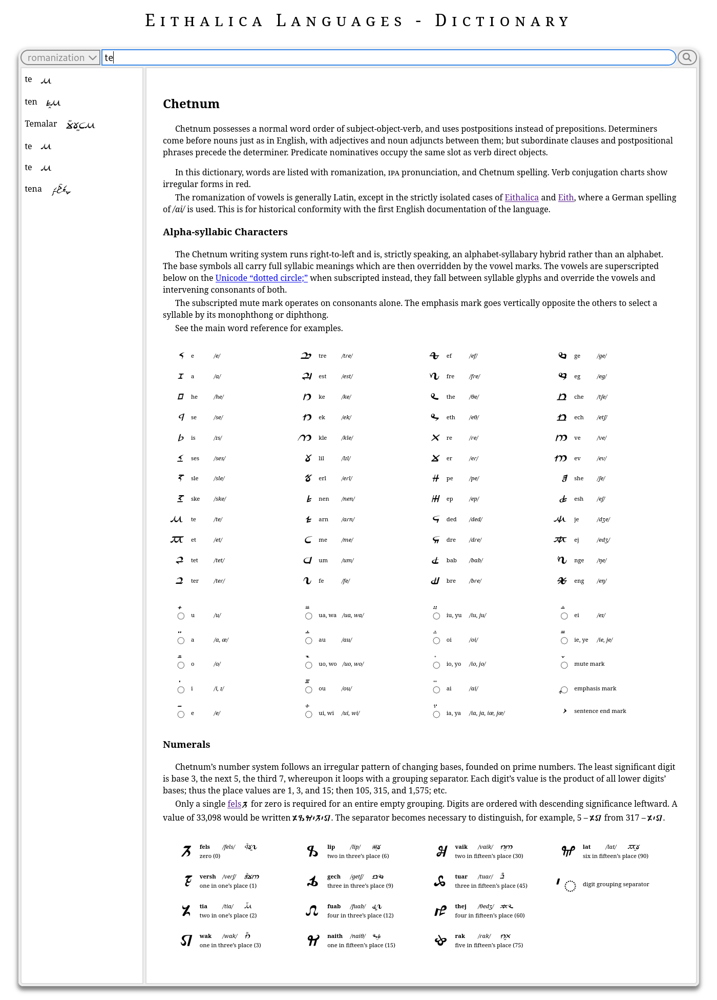

# Tollerus
_Conlang Dictionary System_

Made for use on [https://eithalica.world](https://eithalica.world/lore/dictionary/?lang=chetnum). Named after good ol' "Tollers," the 20th-century conlanger legend.

## Requirements

- Your own website with root admin access
- MySQL
- PHP 8 with `mbstrings` extension

This is a rough-hewn tool that I'm sharing as-is; I haven't invested much time in user-friendliness. It may also be somewhat Anglo-centric, and I don't know how well it accommodates more creative or exotic conlang features.

That said, when it works it is a beautiful dictionary system with a powerful word entry interface.

| Dictionary View | Data Entry System |
|-----------------|-------------------|
|  |  |

## How to Use

### Step 1: Create SVG Font

Follow the instructions [here](https://inkscape-manuals.readthedocs.io/en/latest/creating-custom-fonts.html) to use [Inkscape](https://inkscape.org/) for authoring a font, and save it in the `/asset-src/languages/fonts/` folder. The file `myneography_standard_medium.svg` is there as an example.

This Inkscape SVG file is important because the data entry interface reads it to dynamically create a keyboard.

Consider mapping your conlang glyphs to a [Unicode Private Use Area](https://en.wikipedia.org/wiki/Private_Use_Areas) to avoid ambiguity with other languages/content when copied from your application. If you want to avoid ambiguity even among conlangs, take a look at the [Conscript Unicode Registry](https://www.evertype.com/standards/csur/).

When you're done, export a TTF to `/html/assets/font/` just like the example file `myneography_standard_medium.ttf`.

### Step 2: Write Inflection Schema

For this step, you need to alter the contents of `/conf/languages/inflections.xml`. Observe the schema and add a description of the class types and inflections in your conlang.

There are some presentation attributes that may be confusing, e.g. `stack` and `align_on_stack`. These have to do with the behavior of your inflection tables across responsive CSS breakpoints, when displayed in the dictionary view.

- `fold`: On either tables or rows, the label is hidden when the tables are stacked.
- `stack`: A value of `yes` means that on wide displays, this table is permitted to have other tables beside it, sharing the vertical space.
- `align_on_stack`: For table labels, align left when stacked. (These are centered otherwise.)

### Step 3: Begin Main XML File

This dictionary system is designed to accommodate multiple concurrent conlangs in the same conworld. Each dictionary entry in each language may have one or more word classes, which may have one or more morphologies.

Observe the contents of `/private/languages/data/myconlang.xml` to learn the schema for your conlang's main XML data source. Each conlang belongs in a separate file in this folder, with a file name that matches the machine-friendly identifier in `inflections.xml` in [Step 2 above](#step-2-write-inflection-schema) and in the root level `language` attribute of the XML file.

When you write your own, focus on the alphabet and metadata (including the `svg=""` and `ttf=""` attributes which should match the files you created in [Step 1](#step-1-create-svg-font)), and only enter about one word for each class type. This will allow the data entry system to scrub for precedents in the data and bootstrap your data entry process. Then you can use the graphical interface for the rest of your words.

Pay special attention to the `id=""` attributes and make sure they accord with what's described under [Base64 Unit IDs](#base64-unit-ids) below.

### Step 4: Define Neography CSS

There are two files with CSS that you want to modify to point to your new TTF file that you created in [Step 1 above](#step-1-create-svg-font):

- `/html/style/languages.css` starting at line 27
- `/scripts/php/languages/add_word.php` starting at line 229

You'll notice a difference in the paths given to the same TTF file in these two places:

- `/assets/font/myneography_standard_medium.ttf` vs.
- `/html/assets/font/myneography_standard_medium.ttf`

(This is due to the fact that these two files are expected to be served from different web server contexts and have different definitions of the docroot. Data entry is considered a private process that's purposely inaccessible from the public docroot. See [Data Entry System](#data-entry-system) below.)

The system supports scripts that run either left-to-right, or right-to-left. If your neography reads right-to-left, add these properties to the CSS rule:

```
direction: rtl;
unicode-bidi: bidi-override;
```

Note: It's important that you change not only the file path to match your TTF file, but also the neography class name `myneography` to match the machine-friendly identifier of your neography. HTML will be generated using the `name=""` attribute of the primary script in your XML source, and needs to match the CSS selector here.

### Step 5: Get it Running

#### Dictionary View

To run the dictionary view, you'll need a web server environment with an SQL database.

On your server, use XSLT to transcode the inflections data to more convenient JSON:

```
$ xsltproc -o conf/languages/inflections.json conf/languages/inflections.json.xsl conf/languages/inflections.xml
```

Now look in the `/conf/languages/` folder and use the example file `mysql.json.example` to write in your app's database credentials. Once you have a `languages` database created, from this repo's root directory run `/scripts/sh/languages/db_reset.sh` to compile the SQL scripts and populate the database.

#### Data Entry System

This was designed not to edit the data in a live production environment. For data entry, simply navigate to this repo's root and run:

```
$ php -S 127.0.0.1:4000
```

If you haven't already, make sure to transcode your inflection data from XML to JSON as mentioned in [the step above](#dictionary-view).

Then access the data entry interface at `http://127.0.0.1:4000/scripts/php/languages/add_word.php?lang=myconlang` (but replacing `myconlang` with the machine identifier for your conlang). This script will access the SVG font, the inflection JSON, the main XML data, and the `next_id` file.

Use it to fill out a new dictionary entry. When you hit "save" at the bottom, it will write the new entry to your main XML file, and update the `next_id` file as appropriate.

If you perform this action in another environment, make sure to synchronize changes to your live server and rerun `/scripts/sh/languages/db_reset.sh`.

### Caveats 

Inflection dimensions are hard-coded into the schema. If you need to add a new kind of word inflection, you'll need to edit the database schema in `/scripts/sql/languages/schema.sql`.

Editing this file is also necessary if you find the need to add a new type of word class, etc.

### Base64 Unit IDs

The `entry`, `class`, and `form` data units in this sytem are all tracked using IDs encoded in URL-safe Base64 ([RFC 4648 §5](https://www.rfc-editor.org/rfc/rfc4648#section-5)). A handful of helpful scripts and library functions are provided for handling them.

Importantly, each ID must be unique **across all conlangs** in the system, so that they can cohere and be retrieved inside a single database. To that end, the next ID is tracked globally in a single file `/private/languages/next_id`.

If you are starting from scratch, edit `next_id` to say `AAAA`. Any time you need a new ID, from a command line run the `/scripts/php/languages/increment_id.php` script:

```
$ php -f scripts/php/languages/increment_id.php 
AAAA -> AAAB
```

In the example output above, `next_id` has been incremented from `AAAA` to `AAAB`. This will be accurate if you copy/paste the left ID for immediate use inside your XML data. If you are simply editing a pre-existing data unit, for example from the sample data provided, leave the ID intact and skip this step (unless you add a new class or word form).

There is no need for IDs to be consecutive in your data. The most important thing is simply that they are globally unique, and that you can grow the data without fear of IDs colliding.
