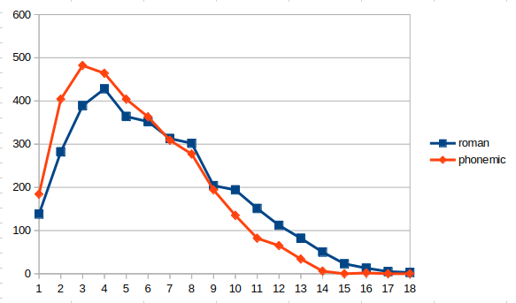

# Word Length in Random Factory

In `src/Database/Factories/FormFactory.php`, a random word length is chosen using this algorithm:

```
y = ( acos(1-2*x)/pi )^1.7 * 9 + 1);
```

It takes a random float `x` between 0 and 1, and maps that linear input range to a nonlinear output range between 1 and 10.

Here's a plot showing the distribution of word lengths after generating over 1,000 dictionary entries through this algorithm:

